# NanoJobs_Changes

[Check Notes file please!](./Notes.md)

## change 1:
Add a new link in the Home Navbar for the branches - the link name **Farnchise**. The **Farnchise** link will go to a new web page containing text and at the end of the page will be fields to fill and three check boxes:

 - field 1: Name
 - field 2: Vorname
 - field 3: User Email
 - field 4: Telefon
 - field 5: Ort
 - field 6: Beruf
 - field 7: Nachricht -> A text box to write the questions and notes
 - 3 check boxes
 - Senden button to send the data by Email

**Note: Check the PDF file below**

examples:
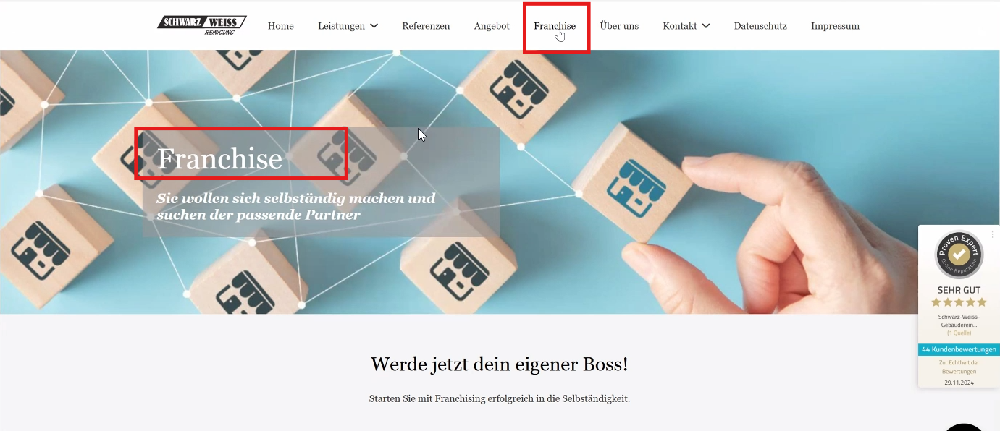

[Franchise page PDF file](https://github.com/alharet7/NanoJobs_Changes/blob/main/Assets/Frenschise%20.pdf)

URL: http://client.nanojobs-gmbh.de/#/home-page 

 ----
 ## change 2:
Reorder the Home Navbar links after adding the **Franchise** link to be in this order: 
Home - Jobseekers - Company - Franchise - Blog - About Us - Contact Us

URL: http://client.nanojobs-gmbh.de/#/home-page 

----

## Change 3: 
Replace the column title in blue in the bottom navbar **Privacy** To -> **Nano Jobs** and move the **Privacy** To be as (a link) below the **Terms & Conditions and Impressum** links.

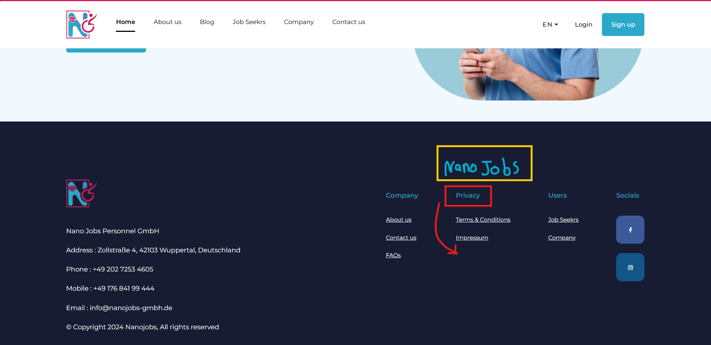

URL: http://client.nanojobs-gmbh.de/#/home-page 

----

## change 3-2:
Replace the Text "Nano Jobs Personnel GmbH" in the lower navbar to -> "Nano Jobs Personal Dienstleistungen GmbH"

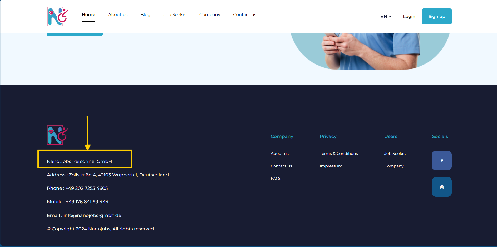

## Change 4:
The **worker-data-info** page will be split into two sections:

 - The First section will be for the data the worker has already filled. (There are changes on the Mobile app which will be covered later in these docs.)

 - The Second section will have 9 fields that the Admin should fill.

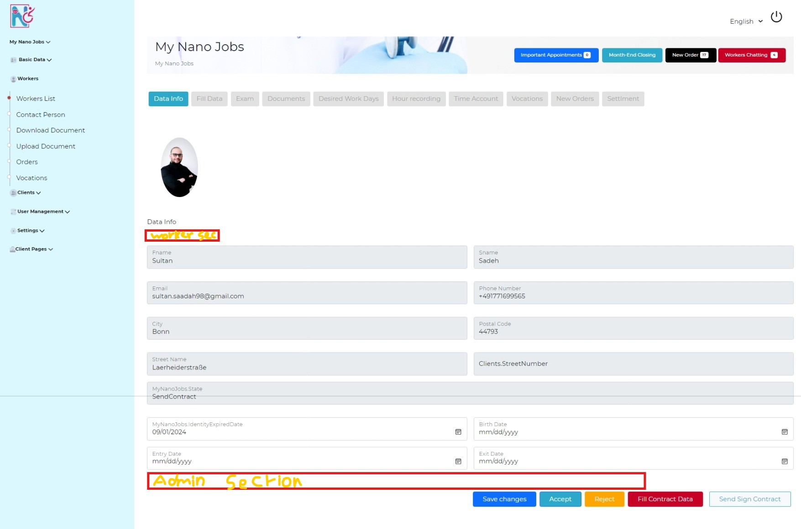

***Note: Mobile app adds 8 fields, Admin fills 9 new fields.***

URL: http://admin.nanojobs-gmbh.de/#/dashboard/workers/details-worker/1/worker-data-info

---
## Change 5:

The **Exit Date** field In the **worker-data-info** page should accept both a date and an empty value to handle two cases (if there is an Exit Date or if it's empty with no date).

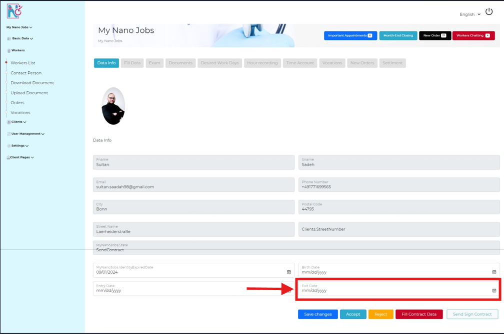

URL: http://admin.nanojobs-gmbh.de/#/dashboard/workers/details-worker/1/worker-data-info

 ---

## change 6:
In the **Mobile App** Add 8 fields in the **Account info** page and ***Note*** that the old 13 fields will stay as is after calling the info from the Registration process
The new Required fields are inside the PDF file below.
The ***Signature*** field should be the first and last name.

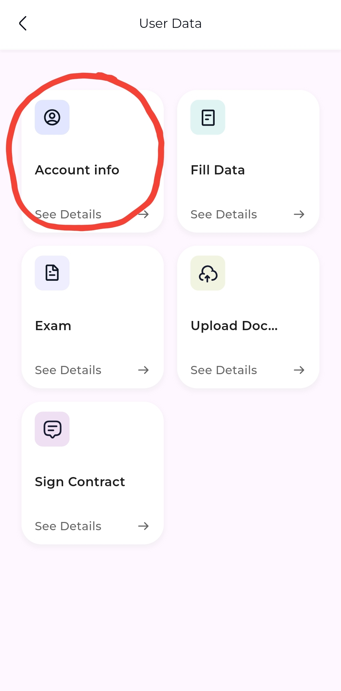

[Account info PDF](https://github.com/alharet7/NanoJobs_Changes/blob/main/Assets/Account%20info%20.pdf)

---
## change 7:

In the **Mobile App** the **Fill Data** pages (Questions & Fields) should fill the fields and reflect the data on a PDF/Word file and give the **Admin** the abitlity to Print it from the **Fill data** section.

### example of Implementation Steps

#### Mobile App (Flutter):
- Capture data from the workers.
- Send the data to the server.

#### Server (Backend - .NET Core):
- Receive data from the mobile app.
- Use a PDF/Word library to populate the PDF/Word template.
- Store the completed PDF/Word or make it available for download.

#### Admin Dashboard (Angular):
- Provide an interface to download, or print the completed PDF. Instead of Displaying the fields.

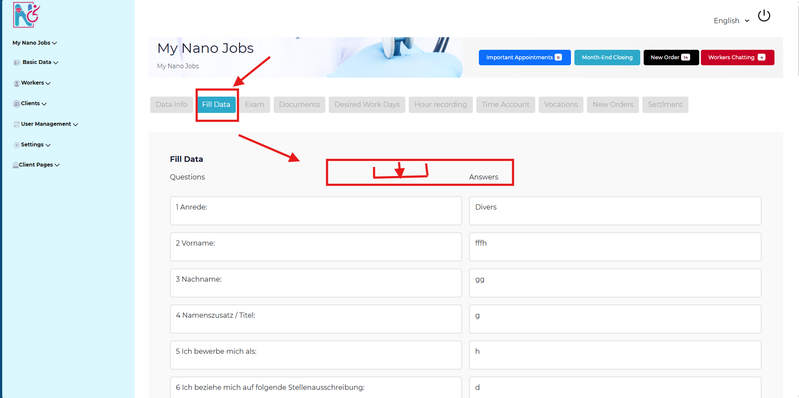

URL: http://admin.nanojobs-gmbh.de/#/dashboard/workers/details-worker/1/worker-fill-data

**Note**: ***There is information (Yellow colored) in the PDF file below that has been entered previously, such as the first and last name and the job title...etc in case you can use it***

[Fill Data PDF]()

---
## Change 8: 

Do the same idea -> In the **Mobile App** the **Exam** pages/check boxes should fill the ***Exam PDF file*** and the Admin should be able to download it from **Exam** page.

### Key Points:

#### Preventing Edits:
- Once the worker submits the exam, lock the responses on the server-side to prevent any changes.
- Mark the exam as completed and disable further edits on the mobile app.(if there is one and if not disable this section)

#### Generating PDF:
- Populate the PDF with the worker's responses using a server-side PDF generation library.
- Provide a **download or print** option for the admin in the **Exam page**.

URL: http://admin.nanojobs-gmbh.de/#/dashboard/workers/details-worker/1/worker-exam

**Note**: ***There is information (Notes Add on the PDF) in the PDF file below that has been entered previously, such as the first and last name and the job title...etc in case you can use it***

[Fragenborgen Alten- und Krankenpflege_Exam](https://github.com/alharet7/NanoJobs_Changes/blob/main/Assets/Fragenborgen%20Alten-%20und%20Krankenpflege_Exam.pdf)

---
## Change 9:

In the **Mobile App** The **Sign Contract** page inside the **User data**:

 - Remove Application Form field
 - Change the **Terms & Conditions** To be -> **Contract** 
 - and the text in that page will be changed later!

---
## Change 10: 

In the **Mobile App** in the -> **Upload Documents** Section

- Remove The additional texts and the Example Image for the ID Card as showen in the image below!
- If there is a front and back of the document, there must be two boxes to add both of them, as in the personal ID card. However, if the document only contains one front, one box only must be displayed to upload the document. 
- File upload should be optional so only available files are uploaded by the worker(Add a skip button please!)

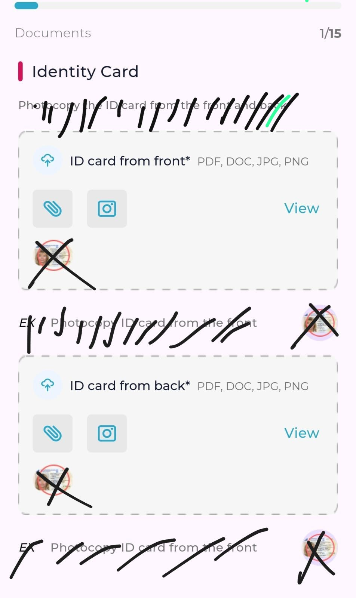

[Upload Documents PDF](https://github.com/alharet7/NanoJobs_Changes/blob/main/Assets/Upload%20Documents%20.pdf)

## Change 11:

In the **Mobile App** -> **Document** Section -> **Personal Request** Section
 - Add Two windows/Boxes 
   - 1st one call/Name it: "Antrag auf Überstunden";
   - 2nd one: "Kündigung";

 - The 1st window/Box **Antrag auf Überstunden** should have two Fields:
  - Gewünschte Anzahl der Überstunden:
  - Monat:

And reflect those data on the ***Antrag Auszahlung  ÜS*** -PDF file below with the other data that provided already before,
After that the Admin will print it from the **Download document** page:

URL: http://admin.nanojobs-gmbh.de/#/dashboard/workers/worker-download

[Antrag Auszahlung  ÜS -PDF file](https://github.com/alharet7/NanoJobs_Changes/blob/main/Assets/Antrag%20Auszahlung%20%20%C3%9CS.pdf)

 - The 2nd window/Box **Kündigung**
  - Use the Data provided already before To fill the main Data (f.name,l.name. Address ...etc). and fill it in the right place on the **Kündigung Muster MA** PDF file provided below.
  - Add a Download button with a note (Download the resignation file / Laden Sie die Kündigungsdatei herunter) - (for the worker on the Mobile.App)!!

[Kündigung Muster MA PDF](https://github.com/alharet7/NanoJobs_Changes/blob/main/Assets/K%C3%BCndigung%20Muster%20MA.pdf)

***Note: For this file, the Worker has to Download it fill it out manually, and send it by Local mail.***

----
## Change 12:

In the **Mobile App** -> **Documents** -> The **Downloads** And **Settlements** Sections is not Downloading the files! Even though the **Download completed** dialogue appear!

---

## Change 13-1:

In the **Mobile App** -> **Time Tracking** -> **Vacations** Section:
 - If he chose the first **Vacation Type** from the DropDown **(Tarif urlaub)**.
 - Send the Data to fill the **Tarifurlaub** PDF file(provided below) when Submit and use the other data that provided already before to fill the rest fields.

[Tarifurlaub PDF file](https://github.com/alharet7/NanoJobs_Changes/blob/main/Assets/Tarifurlaub%20.pdf)

---

## Change 13-1:

In the **Mobile App** -> **Time Tracking** -> **Vacations** Section:
 - If he chose the 2nd **Vacation Type** from the DropDown **(Freizeit Urlaub)**.
 - Send the Data to fill the **Freizeit Urlaub** PDF file(provided below)  and use the other data that provided already before to fill the rest fields when Submit.

[Freizeit Urlaub PDF file](https://github.com/alharet7/NanoJobs_Changes/blob/main/Assets/Freizeit%20Urlaub%20%20.pdf)

---

## Change 13-3:

In the **Mobile App** -> **Time Tracking** -> **Vacations** Section:
 - If he chose the 2nd **Vacation Type** from the DropDown **(Sonder urlaub)**.
 - Send the Data to fill the **Sonderurlaub** PDF file(provided below)  and use the other data that provided already before to fill the rest fields when Submit.
 - Note that please if he added a Comment add it in the proper place in the PDF.

[Sonderurlaub  PDF file](https://github.com/alharet7/NanoJobs_Changes/blob/main/Assets/Sonderurlaub%20.pdf)

---

## Change 13-4:
The Same for the **Unbezahlten Urlaub** Choise:

In the **Mobile App** -> **Time Tracking** -> **Vacations** Section:
 - If he chose the 2nd **Vacation Type** from the DropDown **(Unbezahlten Urlaub)**.
 - Send the Data to fill the **Unbezahlten Urlaub** PDF file(provided below)  and use the other data that provided already before to fill the rest fields when Submit.
 - Note that please if he added a Comment add it in the proper place in the PDF.

[Unbezahlten Urlaub  PDF file](https://github.com/alharet7/NanoJobs_Changes/blob/main/Assets/Unbezahlten%20Urlaub.pdf)

---

## Change 14:

In the **Mobile App** -> **Contract** -> In the **New Order** After the admin submits the job posting, this screen should appear for the worker, but it doesn't!

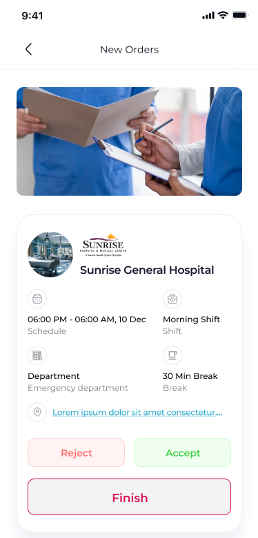

- After he clicks the finish button, he should be transferred to a page with a field that is automatically filled in to the system, but he can edit it, and a screen for it to be signed by the company or entity he worked for. After that, the information is saved in the appropriate place in the PDF file, and both the Clint and the admins can download it.
- The fields are named in the below PDF file.

[Täglicher Tätigkeitsnachweis](https://github.com/alharet7/NanoJobs_Changes/blob/main/Assets/T%C3%A4glicher%20T%C3%A4tigkeitsnachweis.pdf)

---
## Change 15:

In the **Mobile App** -> **User Data** -> The **Sign Contract** Section doesn't work If the application language is German!!  

---
## Change 16:

In the **Mobile App** -> **Time Tracking** -> In The **Time Account** Section The time information should be shown in the form of a graph. It shows through the graph, if he has worked less than the contract agreed upon or more. Then the final result is reflected in the result box?

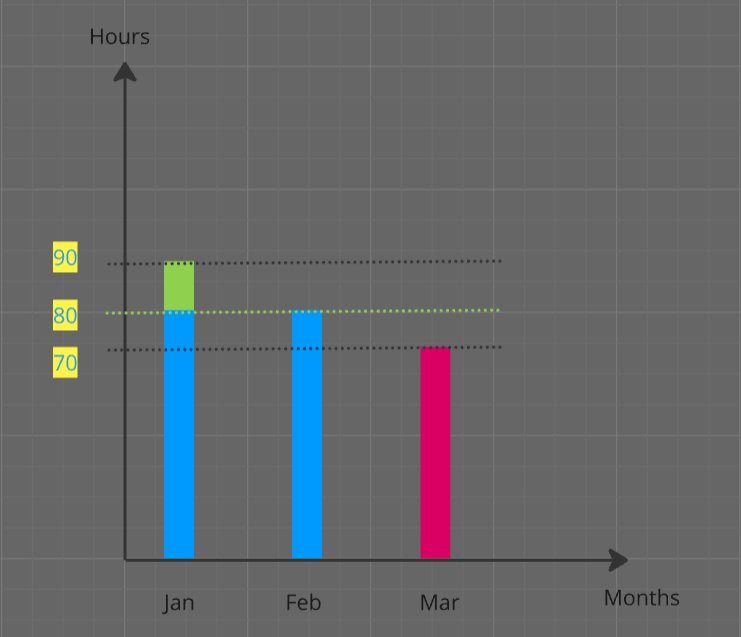

---
## Change 17:

In The **Company Dashboard** -> **My Data** Section -> The second name of the company must appear next to the first name, with a comma between them.

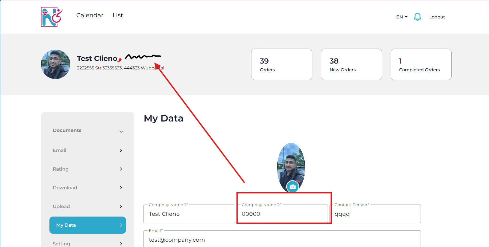

URL: http://client.nanojobs-gmbh.de/#/company-dashboard/my-data

---
## Change 18:

In The **Company Dashboard** -> **Download** Section:
We sent files by admin, but they did not reach the client!

URL: http://client.nanojobs-gmbh.de/#/company-dashboard/download

---
## Change 19:

In The **Company Dashboard** -> **Documents** Section:

 - In the **Contracts** Section There should be two buttons here, one to download the file and one to Upload it and Send it for the Admin.

URL: http://client.nanojobs-gmbh.de/#/company-dashboard/documents/contracts

 - In the **Bills** Section There should be a download button for the invoice and The Admin should Upload it before that!

URL: http://client.nanojobs-gmbh.de/#/company-dashboard/documents/bills

 - In the **Time Cheet** Section: After the employee finishes his work and presses the finish button in the New order Section, The admin must approve it. this File must arrive here so that the **company** can sign it and then re-upload it to be sent to the admins So the Admin can Download it. and a button for the Company to Print/ Download the whole files/month.

URL: http://client.nanojobs-gmbh.de/#/company-dashboard/documents/time-sheet

---
## Change 20:

On this page, the Address field should be filled automatically from the previously entered information in detail, and the name should show the name of the approved worker after the admin has approved it. The status should be dynamic, reflecting the real status of the request. The status names can be found in the following file.

[New orders-Status ](https://github.com/alharet7/NanoJobs_Changes/blob/main/Assets/New%20orders-Status%20.pdf)

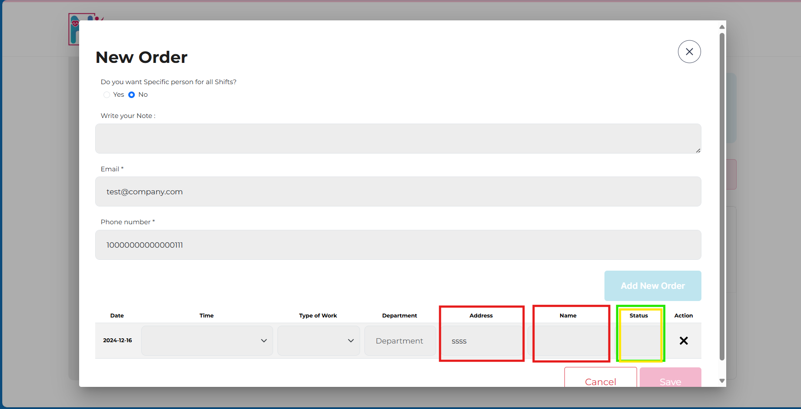
URL: http://client.nanojobs-gmbh.de/#/company-dashboard/documents/calendar

---
## Change 21:
In The **Company Dashboard** -> **Documents** -> **List** Section:

Paginate this page please and check with Sultan for Print mechanisem!

URL: http://client.nanojobs-gmbh.de/#/company-dashboard/documents/list

---
## Change 22:

In the **Admin Dashboard** -> The **Month Closing** Section:

URL: http://admin.nanojobs-gmbh.de/#/dashboard/nano-jobs/month-closing

The same table in the **Worker Hour Recording** should be displayed in **Month Closing**, but without the ability to edit. Even if the data is zero! The table should appear. So I know that he did not work at all during this month.

URL: http://admin.nanojobs-gmbh.de/#/dashboard/workers/details-worker/1/worker-hour-recording

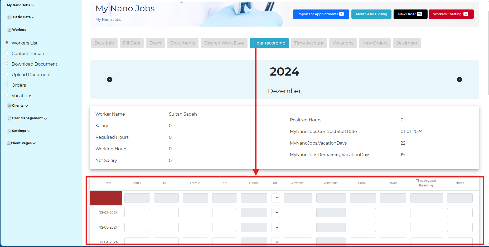

---
## Change 23:

### Authorization Note: For the entire project, the super admin has full authority to see all Workers in all branches, while the admin cannot see workers except in his current city or in his current branch.

--- 
## Change 24:

In the **Mobile App** -> **Contact** -> the **Contact Person** Section:
 - How i can know my Contact per?
 - where is the Image?
 - How i can change him?

**Note:** Aslo it should display only people in this branch or city.(if he wasn't Super Admin)

--- 
## Change 25:

In the **Admin dashboard** -> **Workers** -> in the **Details Worker** Section:
display a Personal number (P.N) for each worker next to or below the Worker Name in the **Hour Recording** section and This P.N  must be entered by the **Admin**.

URL: http://admin.nanojobs-gmbh.de/#/dashboard/workers/details-worker/1/worker-hour-recording

