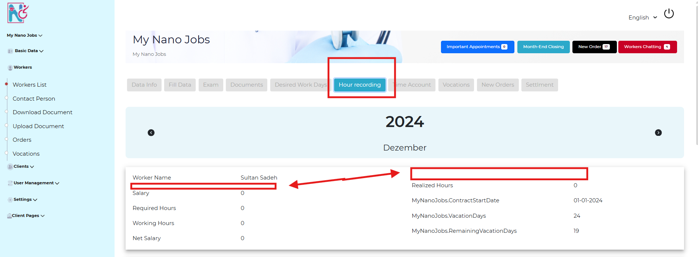

# NanoJobs_Changes

## change 1:
Add a new link at the Home Navbar for the branches - the link name **Farnchise**. The **Farnchise** link will go to a new web page containing a text and at the end of the page will be two fields to fill, just like the Contact Us fields:

 - First field: User Email

 - Second field: A text box to write the questions and notes

examples:

URL: http://client.nanojobs-gmbh.de/#/home-page 

 ----
 ## change2:
Reorder the Home Navbar links after adding the **Franchise** link to be in this order: 
Home - Franchise - Company - Jobs - About Us - Blog - Contact Us

URL: http://client.nanojobs-gmbh.de/#/home-page 

----

## Change3: 
Remove the column titles in blue in the bottom navbar and move the **Privacy** as a link below/ between the **Terms & Conditions and Impressum** links.

URL: http://client.nanojobs-gmbh.de/#/home-page 

----
## Change4:
The **worker-data-info** page will be split into two sections:

 - The First section will be for the data the worker has already filled. (There are changes on the phone app which will be covered later in these docs.)

 - The Second section will have 9 fields that the Admin should fill.

***Note: Number of fields will add by phone app (7) and the new Admin fields to fill will be (9)***

URL: http://admin.nanojobs-gmbh.de/#/dashboard/workers/details-worker/1/worker-data-info

---
## Change5:

The **Exit Date** field In the **worker-data-info** page should accept (None/No value) so it handle two cases (if there is an Exit Date or if it's empty! no date)

URL: http://admin.nanojobs-gmbh.de/#/dashboard/workers/details-worker/1/worker-data-info

 ---
## Change6:

display a Personal number (ID) for each woker next to or below the Worker Name in the **Hour-recording** section

URL: http://admin.nanojobs-gmbh.de/#/dashboard/workers/details-worker/1/worker-hour-recording